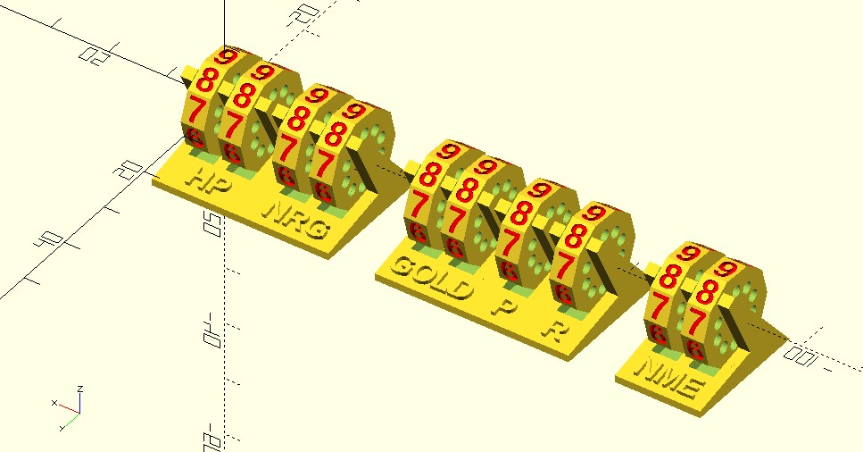

# clicker_counter

I wanted a compact general purpose counter that will fit in the game box and will hold its position.

Should be printed at 0.10mm or smaller.

See /builds/examples/ for, well, examples.

